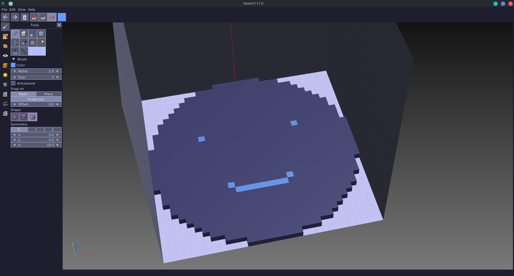

# Catppuccin Mocha Theme for Goxel

A Catppuccin theme for Goxel that totally ignores the Catppuccin style guide.

## Installation

1. Move `catppuccin.ini` to `~/.config/goxel/themes/` *(you'll need to create the themes folder)*
2. In Goxel, `Edit` > `Settings` > `Theme` > `catppuccin-mocha`

## Images

  

